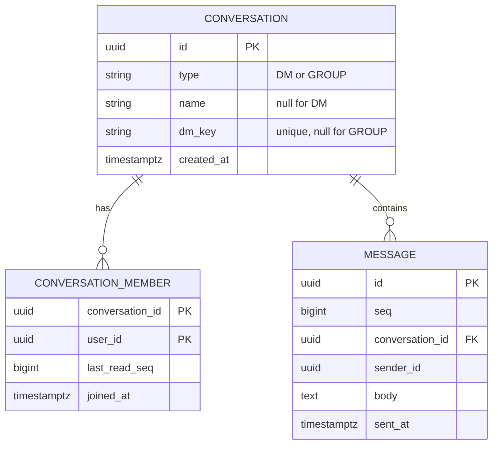
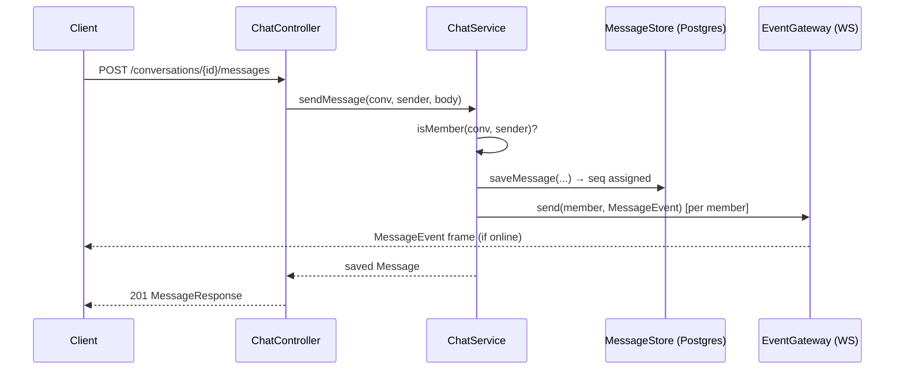

## Entities relationship

```mermaid
erDiagram
    CONVERSATION ||--o{ CONVERSATION_MEMBER : has
    CONVERSATION ||--o{ MESSAGE : contains

    CONVERSATION {
        uuid id PK
        string type "DM or GROUP"
        string name "null for DM"
        string dm_key "unique, null for GROUP"
        timestamptz created_at
    }

    CONVERSATION_MEMBER {
        uuid conversation_id PK
        uuid user_id PK
        bigint last_read_seq
        timestamptz joined_at
    }

    MESSAGE {
        uuid id PK
        bigint seq
        uuid conversation_id FK
        uuid sender_id
        text body
        timestamptz sent_at
    }
```
## Sequence

```mermaid
sequenceDiagram
      participant C as Client
      participant Ctl as ChatController
      participant Svc as ChatService
      participant DB as MessageStore (Postgres)
      participant GW as EventGateway (WS)
      C->>Ctl: POST /conversations/{id}/messages
      Ctl->>Svc: sendMessage(conv, sender, body)
      Svc->>Svc: isMember(conv, sender)?
      Svc->>DB: saveMessage(...) → seq assigned
      Svc->>GW: send(member, MessageEvent)  [per member]
      GW-->>C: MessageEvent frame (if online)
      Svc-->>Ctl: saved Message
      Ctl-->>C: 201 MessageResponse
```