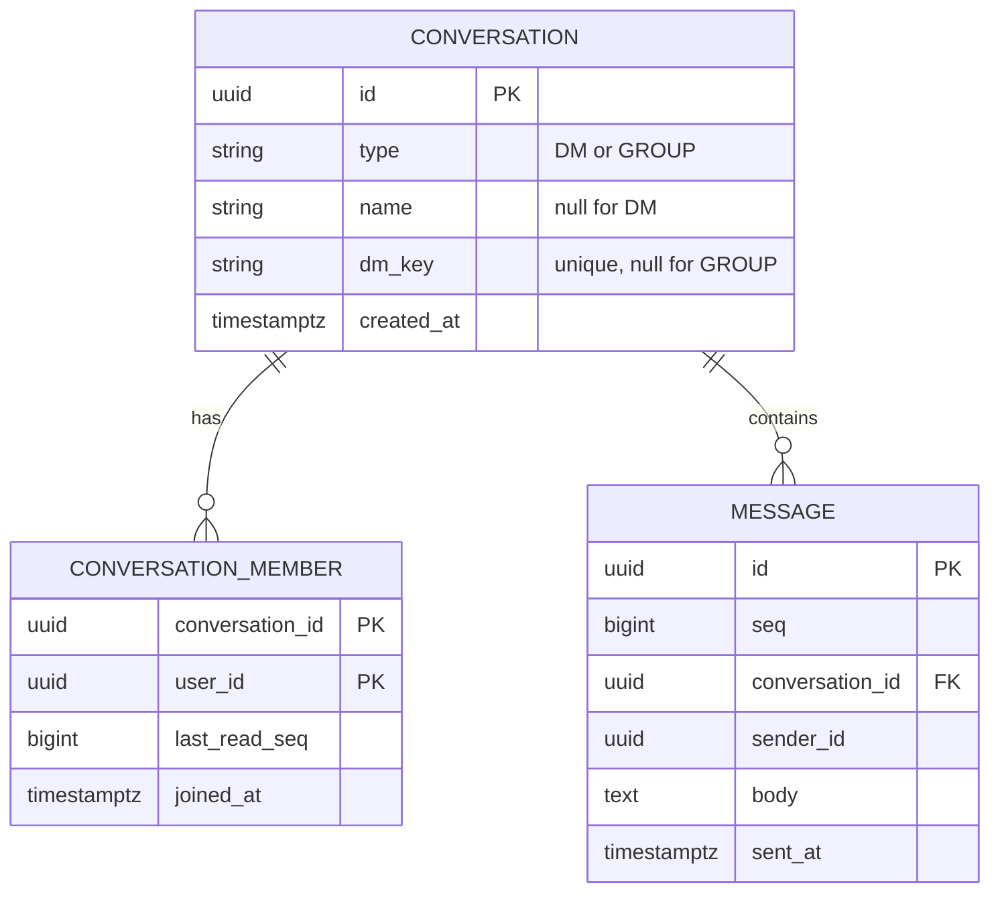

```mermaid
erDiagram
    CONVERSATION ||--o{ CONVERSATION_MEMBER : has
    CONVERSATION ||--o{ MESSAGE : contains

    CONVERSATION {
        uuid id PK
        string type "DM or GROUP"
        string name "null for DM"
        string dm_key "unique, null for GROUP"
        timestamptz created_at
    }

    CONVERSATION_MEMBER {
        uuid conversation_id PK
        uuid user_id PK
        bigint last_read_seq
        timestamptz joined_at
    }

    MESSAGE {
        uuid id PK
        bigint seq
        uuid conversation_id FK
        uuid sender_id
        text body
        timestamptz sent_at
    }
    
```